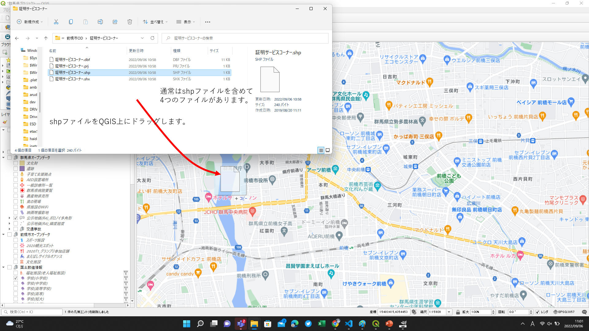

# そのほかのデータについて
QGISやPowerBI以外にも使えるデータは色々とあります。

## Google Map 
Google Mapはデータの宝庫です。鉄道やバスを組み合わせた乗換検索や道路ネットワークや移動推定時間など、移動に関わる数多くのデータがあります。また、移動以外のも観光、グルメなどの情報も満載です。実際に検索してみて、記録をして、ながめてみるのも立派なデータ活用になります。

## RESAS 
RESASは内閣府地方創生室が運営するデータ分析システムです。
### データ分析支援機能
RESASに搭載されている数多くのデータ・分析グラフの中から、第二次産業・第三次産業等、分析テーマに沿った代表的な分析画面を抽出して順に表示します。
各分析画面には、分析の視点となる「グラフの見方」、全国傾向と比較した特徴等を示す「示唆」、分析結果から施策を検討するヒントとしての「施策検討例」等、分析を支援するための様々なコメントが表示されます。また、一部の分析画面では、人口構造・産業構造等の視点から分析対象地域と似通った地域が一覧で表示され、分析グラフに自由に追加できる「類似自治体選択機能」があります。

### まちづくりマップ 近距離移動時間分析
近距離移動で、所要時間と移動可能な範囲を可視化したものです。
1. まちづくりマップ - 近距離移動時間分析 を選ぶ
1. 「メッシュを読み込む」を選ぶ
1. 移動を開始するメッシュをマウスで選択する。
1. 「分析する交通手段」、「移動時間のメッシュ透過率を選択」を選ぶ。
1. 移動時間のメッシュが表示されます。 

### まちづくりマップ 通勤通学人口
市町村単位で、昼間と夜間の人口移動を分析します。 

1. ヒートマップ表示

1. グラフ表示

### この他にも色々なグラフがあるので、試してみてください。

# 政府統計の総合窓口 estat 
政府統計のポータルサイトです。様々なデータがありますが、JSTAT MAPというGISが使えます。
https://jstatmap.e-stat.go.jp/jstatmap/main/trialstart.html

また、GIS以外ので統計データもグラフなどで観ることができます。
https://www.e-stat.go.jp/regional-statistics/ssdsview

# その他 
他のサイトからデータをダウンロードしたときは、以下の方法でQGISに取り込むことができます。

## ファイルの形式がShapeファイル(拡張子がshp)

## CSV形式のとき(座標あり)

## CSV形式のとき(座標なし)
座標がないときは、住所から緯度経度に変換するサイトを利用します。 
https://geocode.csis.u-tokyo.ac.jp/geocode-cgi/geocode.cgi?action=start

その後は、CSV形式のとき(座標あり)と同様です。

## CSV形式のとき(線分)
CSVに線分のカラムを追加します。
線分のカラムは、LINESTRING(緯度 経度, 緯度 経度, ・・・)とします。 
例. 
新町駅,県立女子大前,1016,0,0,0,218736,"LINESTRING(139.105525 36.273268,139.113932 36.29805)",,,
県立女子大前,新町駅,990,0,0,0,214326,"LINESTRING(139.113932 36.29805,139.105525 36.273268)",,,
前橋駅,市役所・合庁前,919,25,1,0,141750,"LINESTRING(139.072342 36.384085,139.064445 36.390637)",,,
前橋駅,県庁前,884,43,0,0,139050,"LINESTRING(139.072342 36.384085,139.061748 36.391019)",,,
