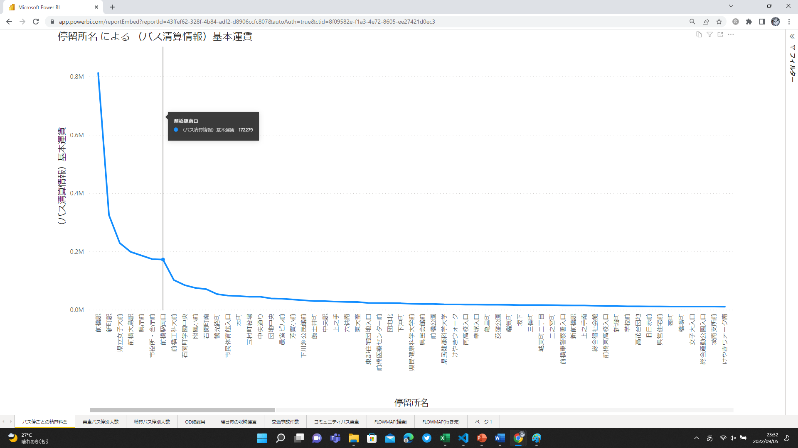

# 用意したビューの説明
永井バスの1ヶ月分のサンプルデータを表示するためのPower BI ビューについて。
## バス停ごとの精算料金
どのバス停が一番稼いでいるかを知ることができます。

## 乗車バス停別人数
バス停から乗車した人数を知ることができます。障碍者の人数なども把握できます。

## 精算バス停別人数
バス停から降車した人数を知ることができます。障碍者の人数なども把握できます。

## OD確認用
乗車-降車のデータを確認することができます。曜日, 日付, 乗車券, 降車バス停や時間帯別の表示も可能です。

## 均一料金乗車バス停
均一料金のバスで、乗車バス停の人数を知ることができます。

## FLOWMAP(搭乗)
乗車したバス停を複数してすることで、指定したバス停から、どのバス停まで移動しているのか、視覚的に表示することができます。
")
## FLOWMAP(行き先)
降車したバス停を複数してすることで、どこのバス停から指定バス停に移動してきているのか、視覚的に表示することができます。
")
## 午前天候別乗車件数
気象庁の天気データから、午前中の天候とバスの乗降人数を知ることができます。

