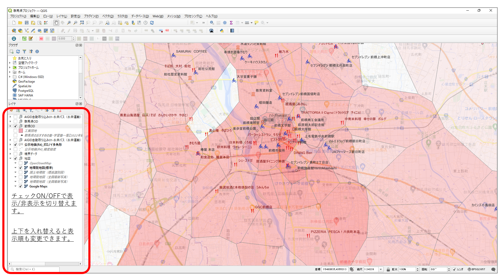
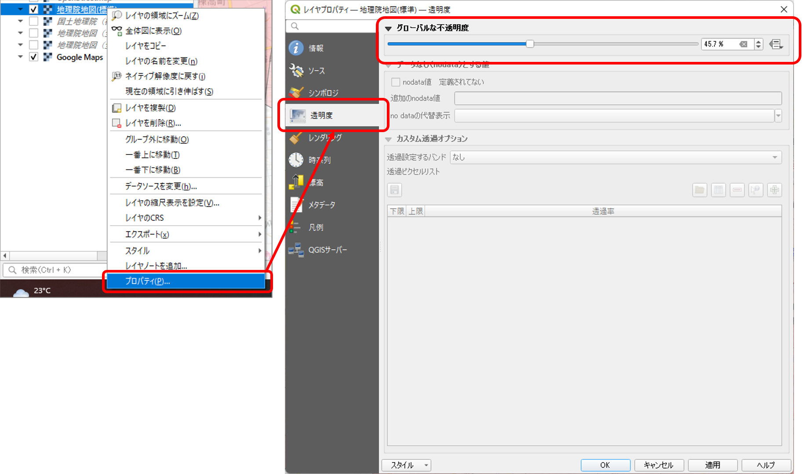
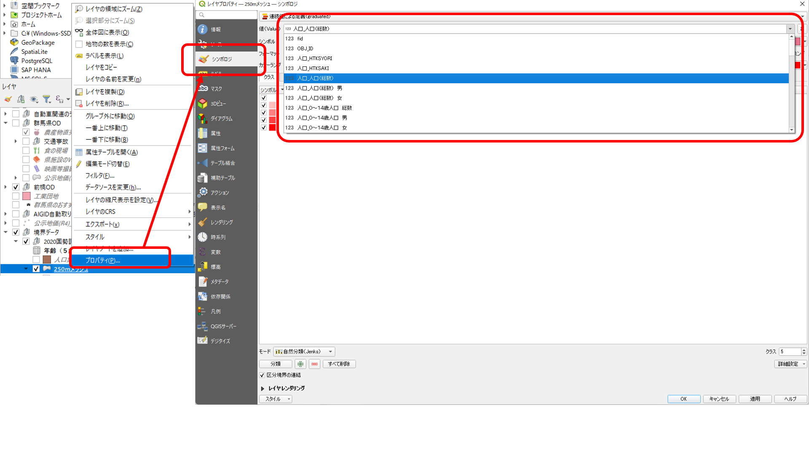
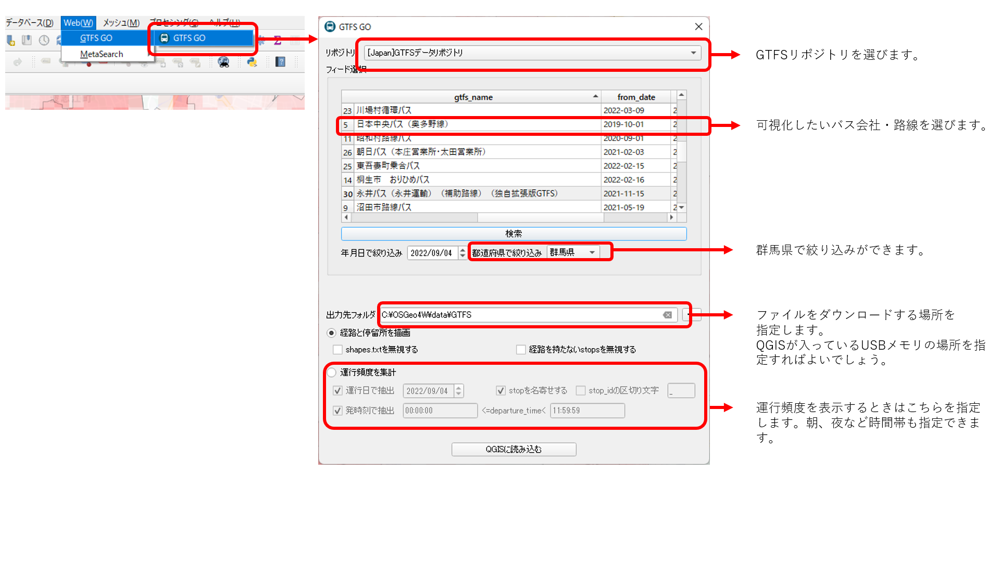

# GISの説明
# 基本説明
## メニュー
レイヤ(データのかたまり)は、事前に準備したものを利用可能です。表示の切替は、赤線部にあるレイヤを操作することが可能です。 
- チェックあり/チェックなしで表示/非表示の切替ができます。
- 順序をマウス操作で入れ替えることにより、表示の重ねる順序を変更できます。

## 地図の透明度変更
地図の色が濃く、画面が見づらいときは、地図の透明度を変更できます。

## メッシュの透明度変更
メッシュの色が濃く、画面が見づらいときは、メッシュの透明度を変更できます。

# 国勢調査データについての補足
## 人口統計
注意事項：人口統計データでは、一部、プライバシー保護のため、秘匿処理をされているものがあります。格納しているデータでは、秘匿処理されている部分は、数値の0に置き換えています。
## メッシュ表示の切替
国勢調査の人口データには、以下の情報が含まれています。
- 人口（総数）
- 人口（総数）　男
- 人口（総数）　女
- ０～１４歳人口　総数
- ０～１４歳人口　男
- ０～１４歳人口　女
- １５歳以上人口　総数
- １５歳以上人口　男
- １５歳以上人口　女
- １５～６４歳人口　総数
- １５～６４歳人口　男
- １５～６４歳人口　女
- １８歳以上人口　総数
- １８歳以上人口　男
- １８歳以上人口　女
- ２０歳以上人口　総数
- ２０歳以上人口　男
- ２０歳以上人口　女
- ６５歳以上人口　総数
- ６５歳以上人口　男
- ６５歳以上人口　女
- ７５歳以上人口　総数
- ７５歳以上人口　男
- ７５歳以上人口　女
- ８５歳以上人口　総数
- ８５歳以上人口　男
- ８５歳以上人口　女
- ９５歳以上人口　総数
- ９５歳以上人口　男
- ９５歳以上人口　女
- 外国人人口　総数
- 外国人人口　男
- 外国人人口　女
- 世帯総数
- 一般世帯数
- １人世帯数　一般世帯数
- ２人世帯数　一般世帯数
- ３人世帯数　一般世帯数
- ４人世帯数　一般世帯数
- ５人世帯数　一般世帯数
- ６人世帯数　一般世帯数
- ７人以上世帯数　一般世帯数
- 親族のみの世帯数　一般世帯数
- 核家族世帯数　一般世帯数
- 核家族以外の世帯数　一般世帯数
- ６歳未満世帯員のいる世帯数　一般世帯数
- ６５歳以上世帯員のいる世帯数　一般世帯数
- 世帯主の年齢が２０～２９歳の１人世帯数　一般世帯数
- 高齢単身世帯数　一般世帯数
- 高齢夫婦世帯数　一般世帯数

## 表示する人口の変更
デフォルトでは、総人口を設定しておりますが、任意に変更ができます。変更方法は以下のとおりです。なお、分類方法は、画面左下にある「モード」、階層数は、「クラス」で変更できますので、色々お試しください。

## バスデータの読む込み方法
QGISのGTFS-GOプラグインを利用します。操作方法は、下図の通りです。

# 用意したレイヤの説明
1. 地図レイヤ 
    1. OpenStreetMap 
    1. 地理院地図(標準) 
    1. 地理院地図(標高識別図) 
    1. 地理院地図(全国最新写真) 
    1. Google Maps
1. 群馬県オープンデータ
    1. 交通死亡事故発生位置
    1. 農産物直売所
    1. 映画等撮影地
    1. 県施設のWiFi
    1. 食の現場
    1. 公示地価
    1. 群馬県病院要覧
    1. 一般診療所一覧
    1. AED設置場所
    1. 子育て支援拠点
    1. 遺跡
    1. 文化財
1. 前橋市オープンデータ
    1. 観光スポット
    1. T1グランプリ参加店
    1. 前橋サイクルオアシス
    1. 文化施設
    1. スポーツ施設
1. 国土数値情報
    1. 福祉施設(老人福祉施設)
    1. 学校
    1. 駅別乗降客数(1日)
    1. 500mメッシュ別将来推計人口データ（H30国政局推計）_2030年
    1. 500mメッシュ別将来推計人口データ（H30国政局推計）_2050年
    1. 交通流動量 貨物・旅客地域流動量データ
1. 国勢調査
    1. 2020年人口(250m)
    1. 2015-2020人口増減(250m)
    1. 小地域（町丁・字等別年齢（５歳階級、４区分）別、男女別人口_総数、年齢「不詳」含む）
    1. 昼間人口(学生含まず)(500m) 　計算方法. 総人口 - 当地に常住する15歳以上就業者・通学者　就業者数 + 経済センサス基礎調査　従業者数-総数　としています。国勢調査は2015年, 経済センサスは2014年のデータを利用しています。
1. オリジナルデータ
    1. 群馬県学習塾一覧(WEBスクレイピング)
    1. 駐車場敷地データ(OpenStreetMap)
    1. バスODサンプルデータ(永井運輸)
